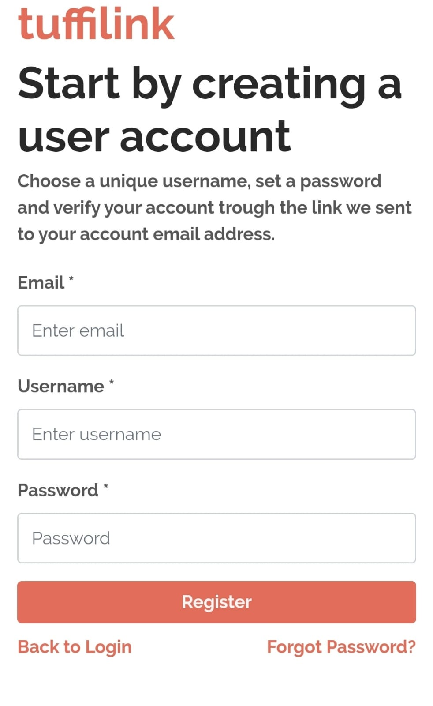
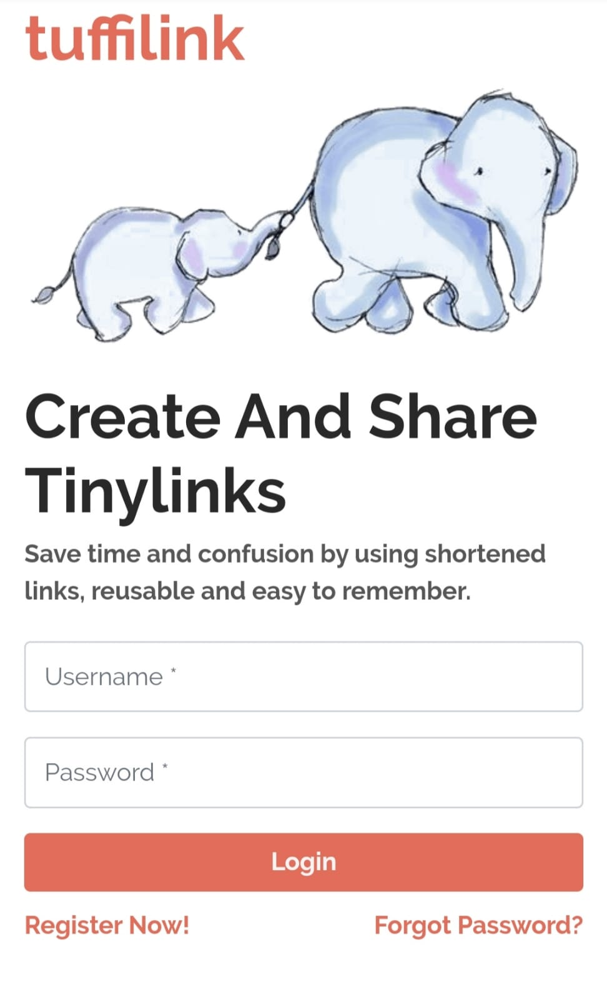
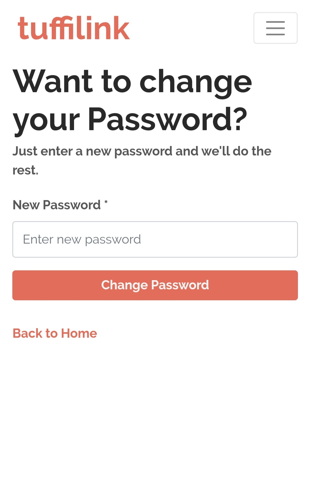
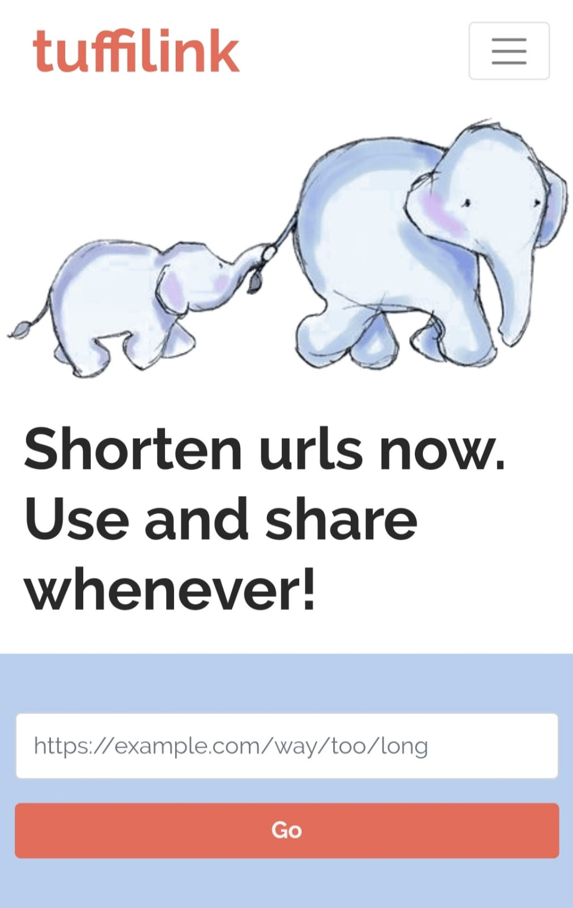
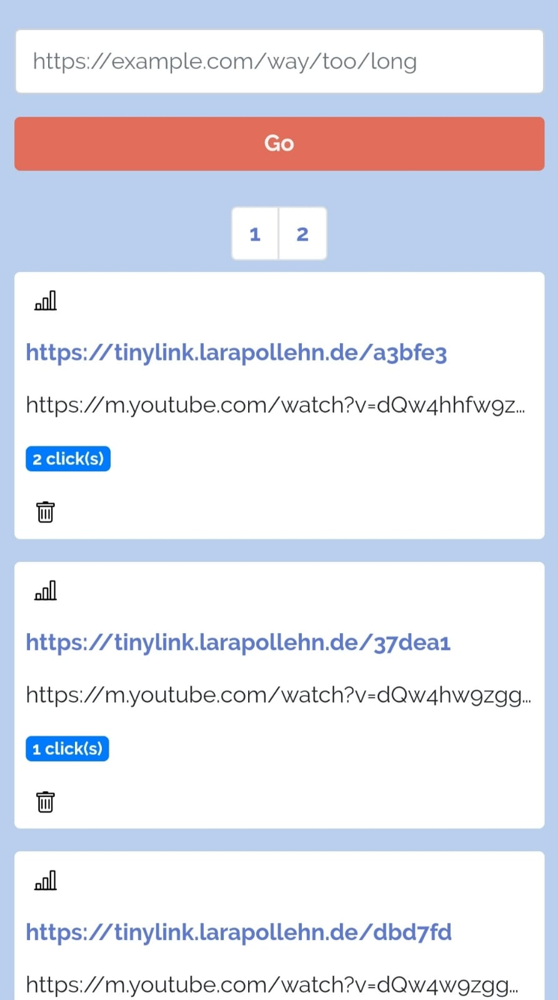
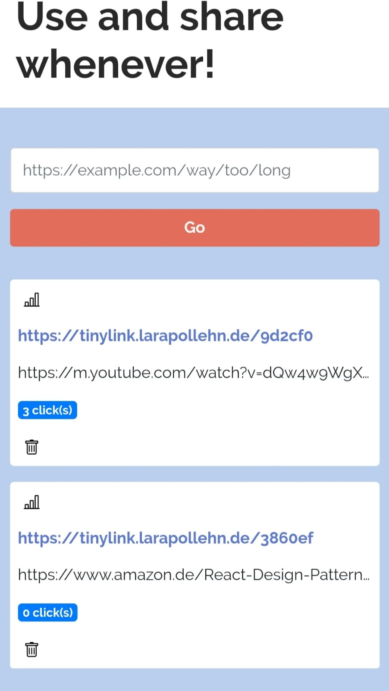
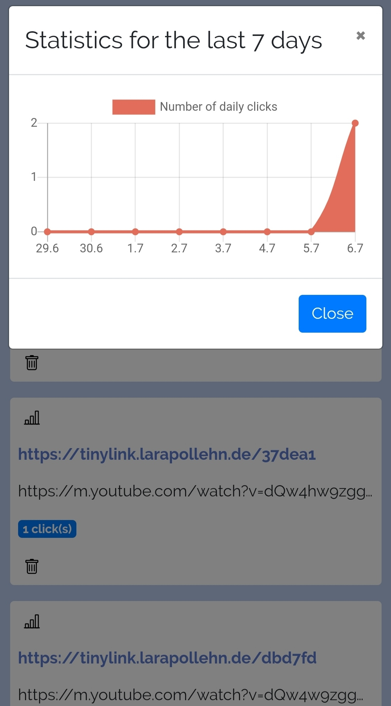
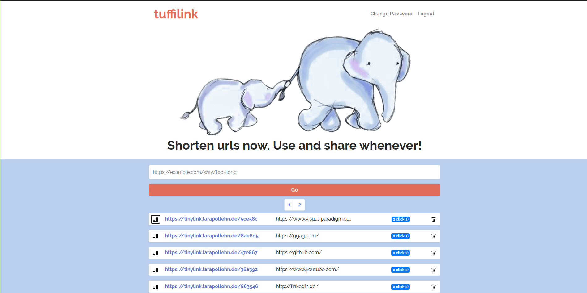

# tuffilink

Scalable system for shortening links. Documentation of the API can be found at 

https://app.swaggerhub.com/apis/larapollehn/tinylink/1.0.0

### Mobile (Xiaomi Redmi Note 5)

<table border="1" width="100%">
    <tr>
        <td></td>
        <td></td>
        <td></td>
        <td></td>
    </tr>
    <tr>
        <td></td>
        <td></td>
        <td></td>
        <td></td>
    </tr>
</table>

### Desktop (Full HD)

