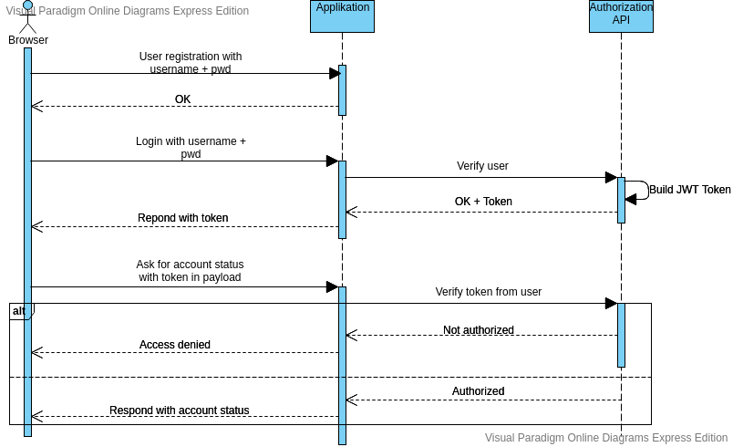

# Tag 2

* Password speichern: one-way hashfunktion z.B. sha256
* Benutzer Credential verifizieren: Credential mit einem schlüssel hashen und diesen hash dann auf kompatibilität mit dem schlüssel prüfen

### Anforderungen an die Sicherheit von Anwendungen
* Vertraulichkeit/Confidentiality: Daten sind sicher vor unauthorisiertem Zugriff (passwort geschützt, verschlüselt, two-factor authentifizierung)
* Integrität/Integrity: Daten sind stets akkurat und vollständig, durch ihre Konsistenz vertrauenswürdig und sicher vor Änderungen von nicht authorisierten Quellen (user access control, backups, versions kontrolle)
* Verfügbarkeit/Availability: Daten sind jederzeit von authorisierten Quellen einsehbar wenn gebraucht (offsite backup, failover, redundancy)
* Authentizität: Echtheit und Glaubwürdigkeit der Daten ist sichregestellt, dies ist überprüfbar, Fälschungen sind ausgeschlossen
* Verbindlichkeit: Änderungen können auf den Ausführenden zurückgeführt werden (user logging)

### Sicherheitskategorien
* Computersicherheit: Ein Computersystem sollte vor Ausfall gesichert werden um ungeplante (und geplante) Ausfallzeit zu vermeiden/verrringern
* Datensicherheit: Schutz der Daten jeglicher Art vor z.B. Manipulation, Verlust und unaithorisiertem Zugriff
* Datensicherung: Daten werden mit backup gesichert um ihre Verfügbarkeit zu gewährleisten
* Datenschutz: schutz der Privätsphäre durch schutz der personenbezogenen Daten und Datenbesitzer

### Häufige Angriffsquellen / Sicherheitsrisiken
* Injection: SQl, NoSQL, OS, innerHtml
* Broken Authentication: kompromieren von Passwörtern, Schlüsseln und Sessiontoken, stehlen von Useridentitäten
* Broken Access Control: keine/ keine wirksame Restriktion bezüglich der Rechte von Nutzern
* Cross-Site Scripting/Xss: nicht vertrauenwürdige Daten werden ohne Überprüfung einbezogen
* Known Vulnerabilities: Komponenten mit bekannten Schwächen werden dennoch eingesetzt/ benutzt

### Authentication vs. Authorization
* Authentication: Identität der User überprüfen und sicherstellen
* Authorization: Legt fest was der User machen darf und worauf er zugriff, änderungsrecht etc. erhält
Ohne Authentication keine Authorization, authentication muss vor authorization passieren

### Authorization Header
contains credentials to authenticate a user on a server
a common method is basic combined with a base64 encoded string of username:password
z.B. Authorization: Basic HDkdhflsdfmKDJlkdjf | Authorization: <type> <credentials>
A server responds with the WWW-Authenticate header to define the authentication method that should be used to gain access

#### Basic access authentication
Method of access control 
Method of a HTTP user agent to provide username and password during a request, found in the header field 'Authorization'
Credentials are username and password, seperated by a colon (user:pwd), encoded with base64
Encoding with base64 is not secure like hashing, encrypting so Basic is commonly used with HTTPS

### HMAC (Hashed Message Authentication Code)
MAC wird mit einem kryptografischen Hashwert, der Nachricht zusammen mit einem geheimen Sclüssel, konstruiert.
HMACs werden oft für SSH und TLS verwendet.
-> A MAC is a signature based on a secret key, someone in possesion of the secret key can verify if the MAC can be trusted

### JWT Token (JSON Web Token)
ein auf JSON basiernder Access-Token der HMAC zusammen mit einem Secret-Token verwendet.
Wird z.B. zur Übermittlung von Useridentitäten zwischen einem Identity-Provider and Service-Provider genutzt.
Alle benötigten Infos zur Authentifikation werden im Token gespechert anstatt auf dem Server, somit kann eine stateless session implementiert werden
* Aufbau: Header (algorithm und typ; hs256 und JWT zum beipsiel), Payload (username etc.), Signatur (HMAC mit Hashfunktion und Secret, sowie mit base64 encodierter Header und payload) 
Header, Payload und SIgnatur werden mit einem Punkt getrennt durch Base64 kodiert
* JWT wird z.B. in der URL oder im HTTP-header (Authorization als Bearer Token oder Cookie Feld) übertragen
z.B. Authorization: Bearer <JWT>

Wird der claim 'exp' im payload angegeben, legt der entsprechende Wert die Lebdauer des Token fest, der Zeitstempel gibt an, ab wann der Token nicht mehr akzeptiert wird
Mittels eines Refresh-Token kann jedoch ein "abgelaufener" Access-Token erneuert werden.
Gefährlich: Wird nur die Gültigkeit des Refreshtoken überprüft und nicht die Zugehörigkeit zum Access-Token kann dies ausgenutztz werden

{"alg":"HS256","typ":"JWT"}
{"sub":"1234567890","name":"John Doe","iat":1516239022}
SflKxwRJSMeKKF2QT4fwpMeJf36POk6yJV_adQssw5c

